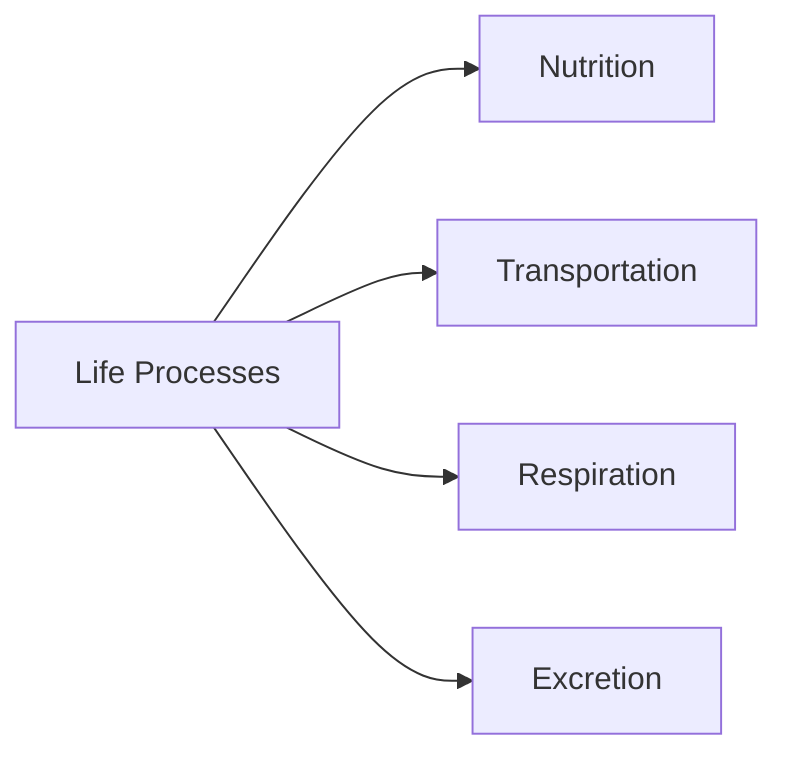

	Life processes are processes that are essential for the surviaval of an organism. 

```mermaid
graph LR

%% Nodes
A[Life Processes]
B[Nutrition]
C[Transportation]
D[Respiration]
E[Excretion]

%% Node Connections
A --> B
A --> C
A --> D
A --> E
%% Node Link
click B href "obsidian://vault/Science/Biology/Life Processes/Nutrition.md"
click C href "obsidian://vault/Science/Biology/Life Processes/Transportation.md"
click D href "obsidian://vault/Science/Biology/Life Processes/Respiration.md"
click E href "obsidian://vault/Science/Biology/Life Processes/Excretion.md"
```