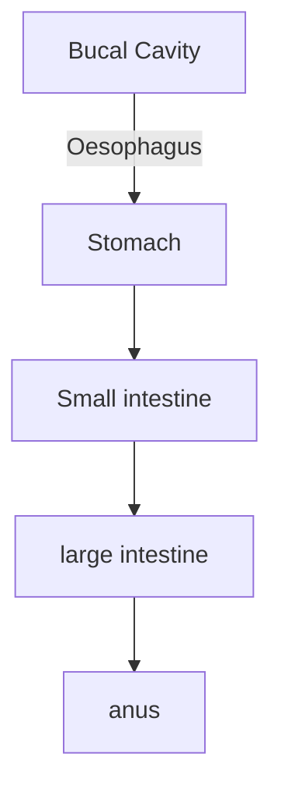

	Human use heterotrophic mode of nutrition meaning that humans don't produce their own food.
	

```mermaid
graph TD
%% Nodes
A[Bucal Cavity]
B[Stomach]
C[Small intestine]
D[large intestine]
E[anus]
%% Node Connections
A -->|Oesophagus| B
B --> C
C --> D
D --> E
%% Node Link
```
# oink